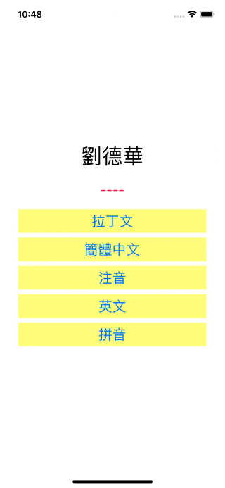

# WWStringTransform

[](https://developer.apple.com/swift/) [](https://developer.apple.com/swift/)  [](https://developer.apple.com/swift/) [](https://developer.apple.com/swift/)

## [Introduction - 簡介](https://swiftpackageindex.com/William-Weng)
- [String transform - latin / english / pinyin / bopomofo / hansHant / hantHans.](https://developer.apple.com/documentation/foundation/stringtransform)
- [文字轉換 - 拉丁文 / 英文 / 拼音 / 注音 / 正體中文 / 簡體中文。](https://medium.com/彼得潘的-swift-ios-app-開發問題解答集/利用-stringtransform-icu-string-transform-做文字轉換-拼音-注音-繁簡轉換-bfbb78e4678e)



## [Installation with Swift Package Manager](https://medium.com/彼得潘的-swift-ios-app-開發問題解答集/使用-spm-安裝第三方套件-xcode-11-新功能-2c4ffcf85b4b)
```bash
dependencies: [
    .package(url: "https://github.com/William-Weng/WWStringTransform.git", .upToNextMajor(from: "1.0.0"))
]
```

## 可用函式
|函式|說明|
|-|-|
|convertText(_:type:reverse:)|文字轉換|

## Example
```swift
import UIKit
import WWStringTransform

final class ViewController: UIViewController {
    
    @IBOutlet weak var messageLabel: UILabel!
    @IBOutlet weak var resultLabel: UILabel!
    
    override func viewDidLoad() {
        super.viewDidLoad()
    }
    
    @IBAction func hantHansConverter(_ sender: UIButton) {
        resultLabel.text = WWStringTransform.shared.convertText(messageLabel.text, type: .hantHans)
    }
    
    @IBAction func bopomofoConverter(_ sender: UIButton) {
        resultLabel.text = WWStringTransform.shared.convertText(messageLabel.text, type: .bopomofo)
    }
    
    @IBAction func englishConverter(_ sender: UIButton) {
        resultLabel.text = WWStringTransform.shared.convertText(messageLabel.text, type: .english)
    }

    @IBAction func latinConverter(_ sender: UIButton) {
        resultLabel.text = WWStringTransform.shared.convertText(messageLabel.text, type: .latin)
    }

    @IBAction func pinyinConverter(_ sender: UIButton) {
        resultLabel.text = WWStringTransform.shared.convertText(messageLabel.text, type: .pinyin)
    }
}
```


